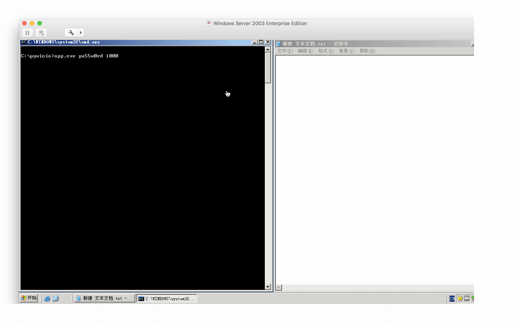

## pywinio

pywinio - 基于 [rabird.winio](https://github.com/starofrainnight/rabird.winio) 实现的键盘输入工具, 可以用于银行安全控件的输入等。

> 在写爬虫的时候, 使用 selenium 模拟登陆, 有时候会遇到网页加入了安全控件, 这时候selenium 是无能为力的, 所以找到了 winio 的方式模拟键盘输入.

## 使用用法

在终端或者用程序去调用 exe 文件中的可执行文件， 分别为64版本和32版本

> 注意: 64版操作系统兼容32版, 键盘必须为ps/2接口或者笔记本键盘, 需要管理员权限运行
>
> 若是64位系统, 需要使用下面命令开启测试模式
>
> `bcdedit.exe /set TESTSIGNING ON`

调用格式:

```
app.exe [keyword] [interval(mills)]
```

`keyword` 表示要输入的字符

`interval` 表示每个字符输入间隔 (毫秒)

效果如下图所示:



## Licenses

MIT


